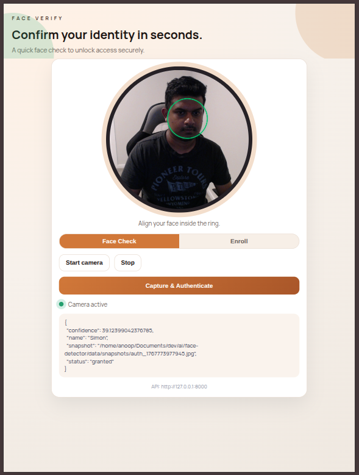
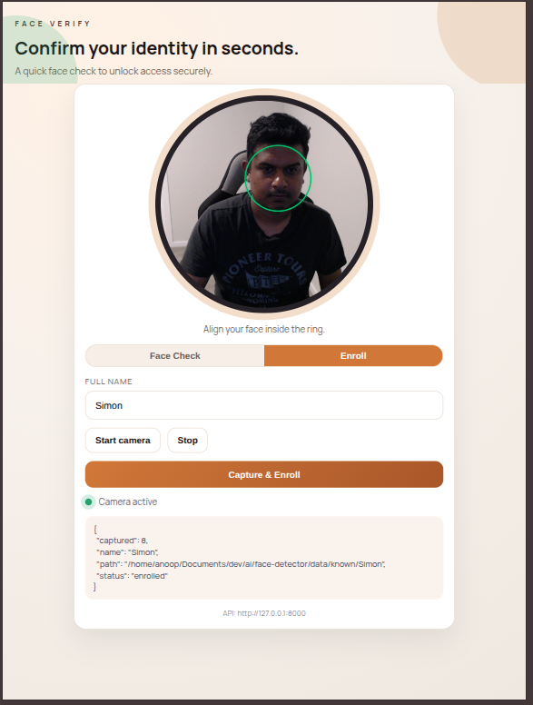

# Face Detector (OpenCV)

## 1. What is it
A small local face-recognition demo that lets you enroll faces, train an LBPH model, and authenticate using a webcam.
It is split into two parts:

- SDK: Python module that exposes the core APIs and does the heavy lifting.
- Client: a tiny JS library + reference HTML page that can be hosted via a CDN and plugged into any UI.

### 1.a What problem does it solve
It provides a simple, offline way to learn face enrollment and recognition flows without cloud services.

### 1.b Simple learning project
This is a small learning project to understand basic face datasets, training, and camera-based inference.

## 2. Tool stack and purpose

| Tool | Purpose |
| --- | --- |
| Python | Application runtime |
| OpenCV | Face detection + LBPH recognition |
| Flask | REST API server (SDK-backed) |
| SQLite | Local auth logs |
| Flasgger | Swagger UI for API docs |

## 3. Available endpoints

- `POST /signup` enroll a person and retrain
- `POST /authenticate` authenticate once from camera
- `POST /authenticate-frame` authenticate from a client-captured image
- `POST /deletefaces` clear all known faces, models, snapshots, and logs
- `GET /ui` simple HTML dashboard
- `GET /known/<person>/<filename>` serve stored face images
- `GET /apidocs` Swagger UI

Swagger UI: `http://127.0.0.1:8000/apidocs`

## 4. How to build and run

Build (install dependencies):

```bash
python3 -m venv .venv
source .venv/bin/activate
pip install -r requirements.txt
```

Run (server):

```bash
python app.py serve
```

Client capture (browser):

Serve the `client/` folder from any static host and point it at the API.

## 5. SDK + Client split

SDK module:

```text
sdk/core.py    core face detection + training + authentication
sdk/server.py  Flask app factory (REST API)
```

Client assets (pluggable, host separately):

```text
client/face-auth-client.js  CDN-friendly client SDK (window.FaceAuthClient)
client/index.html           reference UI (uses the SDK)
```

Use the client SDK in your own UI:

```html
<script src="https://your-cdn.example.com/face-auth-client.js"></script>
<script>
  const client = new FaceAuthClient({
    baseUrl: "http://127.0.0.1:8000",
    video: document.querySelector("video")
  });
  await client.startCamera();
  const result = await client.authenticate();
  console.log(result);
</script>
```

## 6. UI Preview

Authenticate flow:



Enroll flow:



Run the API with CORS enabled when hosting the UI on a different domain:

```bash
python app.py serve --cors "http://127.0.0.1:5500"
# or: python app.py serve --cors auto
```

Reference UI (static) supports an `api` query param:

```text
https://your-ui.example.com/index.html?api=http://127.0.0.1:8000
```
